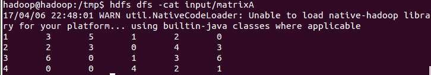
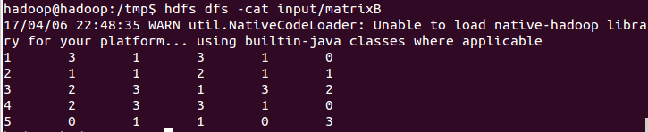
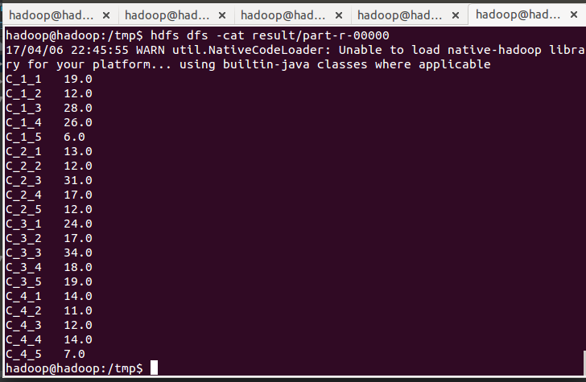

# MatrixMultiply
Use MapReduce to compute the product of two matrix.

# Usage
We need put two files (matrixA and matrixB) onto the HDFS in advance. The shell ommand is: 
hdfs dfs -put matrixA input 
hdfs dfs -put matrixB input 
matrixA and matrixB is the two files like the picture pic1 and pic2 below. 
Then, we can run the MatrixMultiply.java. We can check the result by the below shell command: 
hdfs dfs -cat /result/part-r-00000 
The result is like the picture pic3 below. 

# Illustration
 
pic1: Matrix A (4x5) 
The first column is the row number of matrix A.

 
pic2: Transposition of Matrix B (5x5) 
The first column is the row number of the transposition of matrix B.

We get the product of matrix A and matrix B by computing the A\*(transopisition of B).

In map stage: if file name is 'matrixA', the key C\_i\_j represents the row i, the value is a series of column-value splitted by colon; if file name is 'matrixB', the key C\_i\_j represents the column j, the value is a series of row-value splitted by colon. 
In reduce stage: if two keys are same, split the value into an array, and multiply the values which have the same index in array, then add all the middle calculated value.

 
pic3: The Result File
